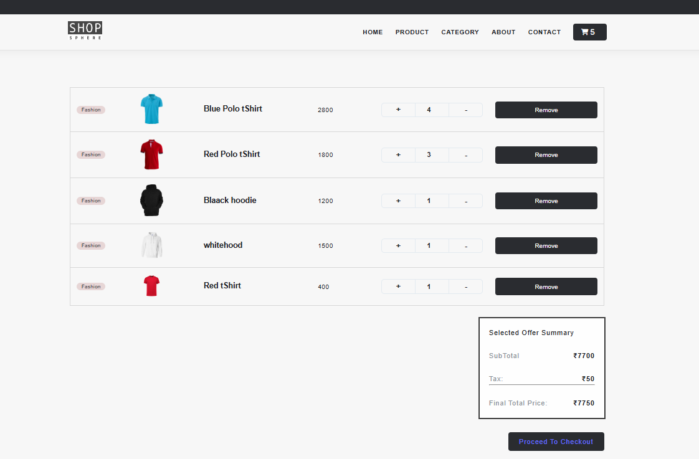

# ShopShere Ecommerce Website

Welcome to the ShopShere Ecommerce Website! This project is a dynamic ecommerce platform built using HTML, CSS, and JavaScript. It aims to provide a seamless shopping experience for users.

## Table of Contents

Features

Technologies Used

Installation

Usage

Contributing

License

Contact

## Features

User-friendly interface for easy navigation

Dynamic product listings

Shopping cart functionality

Responsive design for mobile and desktop

Checkout process with confirmation

## Technologies Used

HTML: Structure of the website

CSS: Styling and layout

JavaScript: Interactivity and dynamic content

Vite: Build tool for modern web projects

## Installation

To get started with the ShopShere Ecommerce Website, follow these steps:

1. **Clone the repository:**
   ```bash
   git clone https://github.com/Deepanshu8560/ShopShere-Ecommerce-Website.git
2. **Navigate to the project directory:**
   ```bash
   cd ShopShere-Ecommerce-Website
3. **Install the dependencies:**
   ```bash
   npm install
4. **Start the development server:**
   ```bash
   npm run dev
  





